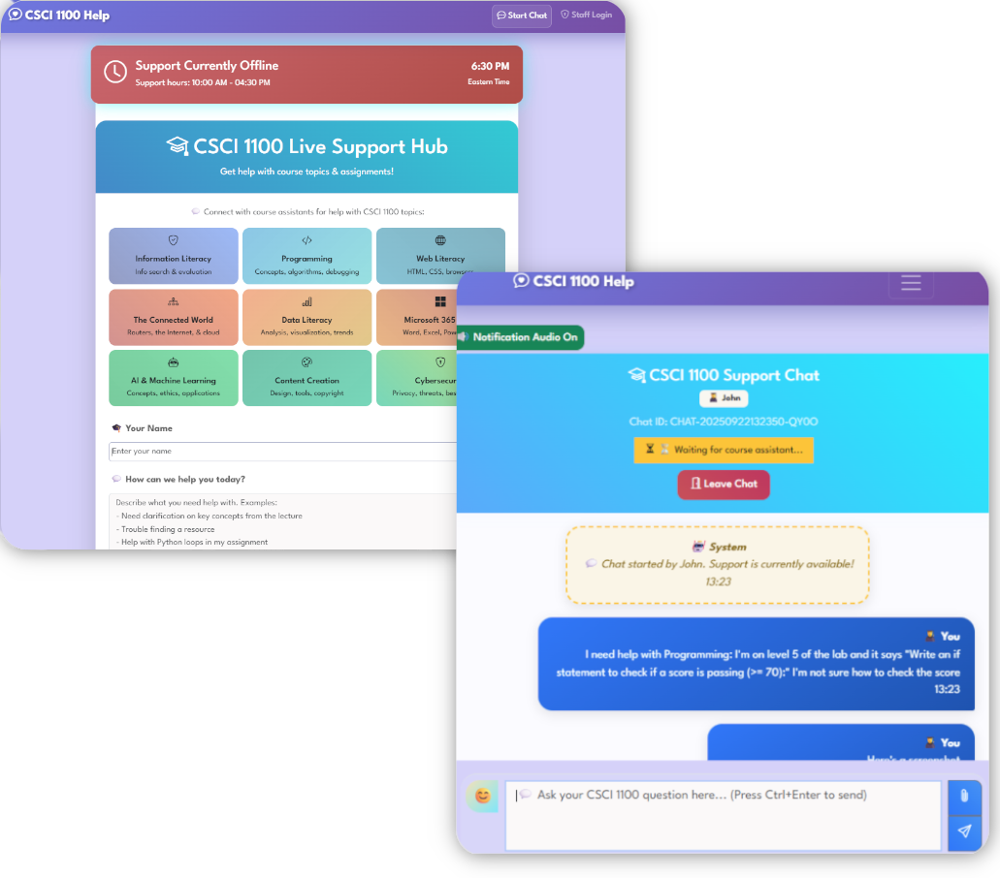
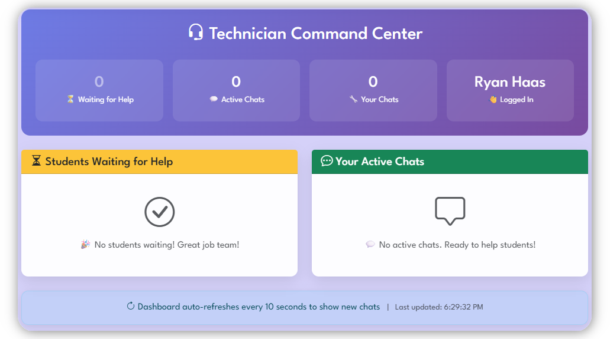

# Support Chat - Django Live Chat Application

A real-time chat support system built with Django for CSCI 1100 course assistants to provide live help to students. See it deployed at: https://classmanager.co/chat/



## Features

- **Student Interface**: Students can initiate chat sessions without authentication
- **Technician Dashboard**: Course assistants can view and join waiting chats
- **Multi-technician Support**: Multiple assistants can collaborate on a single chat
- **File Attachments**: Support for images, documents, code files, and more
- **Schedule Management**: Configure support hours and special schedule overrides
- **Session-based Access**: Students can reconnect to their chats using browser sessions
- **Real-time Updates**: Auto-refreshing chat interfaces with notification sounds



## Technology Stack

- **Backend**: Django 5.1.7+
- **Database**: SQLite (development) / PostgreSQL (production)
- **Server**: Gunicorn + Nginx (production)
- **Frontend**: Bootstrap 5.3 with custom CSS
- **File Storage**: Local filesystem with automatic cleanup

## Project Structure

```
support_chat/
├── accounts/         # User management and authentication
├── chat/             # Core chat functionality
├── static/           # CSS, JavaScript, images
├── templates/        # HTML templates
├── media/            # Uploaded files (generated)
├── manage.py         # Django management script
├── dev_runserver.sh  # Development server launcher
└── support_chat/     # Project settings
    ├── settings.py      # Production settings
    └── settings_dev.py  # Development settings
```

## Installation

### Development Setup

1. **Clone the repository**

```bash
   git clone <repository-url>
   cd support_chat
```

2. **Create a virtual environment**

```bash
   python -m venv .venv
   source .venv/bin/activate  # On Windows: .venv\Scripts\activate
```

3. **Install dependencies**

```bash
   pip install -r requirements.txt
```

4. **Run migrations**

```bash
   python manage.py migrate --settings=support_chat.settings_dev
```

5. **Create a system manager account**

```bash
   python manage.py create_system_manager \
       --settings=support_chat.settings_dev \
       username \
       email@etsu.edu \
       password \
       "First" \
       "Last" \
       "System Manager" \
       "Computing"
```

6. **Initialize default schedule (optional)**

```bash
   python manage.py init_schedule --settings=support_chat.settings_dev
```

7. **Run the development server**

```bash
   ./dev_runserver.sh
   # Or manually:
   python manage.py runserver --settings=support_chat.settings_dev
```

8. **Access the application**
    - Student interface: [http://localhost:8000/](http://localhost:8000/)
    - Staff login: [http://localhost:8000/accounts/login/](http://localhost:8000/accounts/login/)
    - Admin interface: [http://localhost:8000/admin/](http://localhost:8000/admin/)

### Production Setup

See [Production Setup Guide](./production_setup.md)

## Management Commands

### Create System Manager

```bash
python manage.py create_system_manager [--settings=support_chat.settings_dev] \
    username email@etsu.edu password "First" "Last" "Job Title" "Departments"
```

### Initialize Default Schedule

```bash
# Business hours (9 AM - 4:30 PM, Mon-Fri)
python manage.py init_schedule [--settings=support_chat.settings_dev]

# Extended hours (9 AM - 6 PM, Mon-Fri)
python manage.py init_schedule --extended-hours [--settings=support_chat.settings_dev]

# Finals week (9 AM - 7 PM, Mon-Fri)
python manage.py init_schedule --finals-week [--settings=support_chat.settings_dev]

# Force overwrite existing schedule
python manage.py init_schedule --force [--settings=support_chat.settings_dev]
```

### Clean Up Old Chats

```bash
# Delete closed chats older than 7 days (dry run)
python manage.py cleanup_old_chats --dry-run [--settings=support_chat.settings_dev]

# Actually delete them
python manage.py cleanup_old_chats [--settings=support_chat.settings_dev]

# Custom retention period
python manage.py cleanup_old_chats --days 30 [--settings=support_chat.settings_dev]
```

## User Roles

### System Manager

- Full administrative access
- Can create and manage technician accounts
- Can configure support schedules
- Can create schedule overrides for holidays/special events
- Can join and manage all chats

### Technician (Course Assistant)

- Can view waiting chats on the dashboard
- Can join and respond to student chats
- Can upload files and use quick responses
- Can close completed chats

### Student

- No account required (session-based)
- Can start chat sessions
- Can send messages and upload files
- Can leave chats voluntarily

## Configuration

### File Upload Settings

Located in `settings.py` and `settings_dev.py`:

- Maximum file size per upload: 5 MB
- Maximum total size per message: 25 MB
- Maximum files per message: 10
- Supported file types: Images, documents, code files, archives

### Session Settings

- Session duration: 24 hours
- Sessions persist across browser restarts
- Students can reconnect using the same session

### Schedule Management

- Configure weekly support hours by day
- Set special hours for holidays/events
- Override regular schedule for specific dates
- Real-time availability status on landing page

## Development Notes

### Running Tests

```bash
python manage.py test --settings=support_chat.settings_dev
```

### Development Server Script

The `dev_runserver.sh` script automatically uses development settings:

```bash
./dev_runserver.sh
```

### Database Migrations

When making model changes:

```bash
python manage.py makemigrations --settings=support_chat.settings_dev
python manage.py migrate --settings=support_chat.settings_dev
```

## License

Do-whatever-you-want license :P
